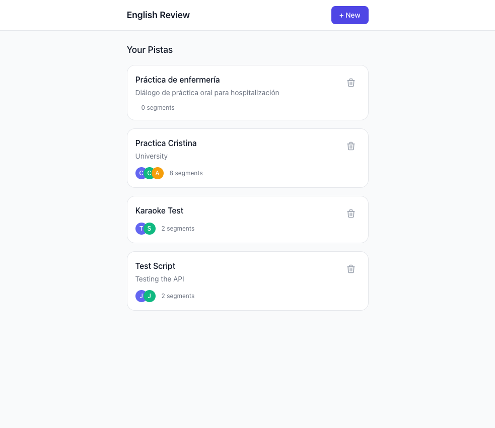
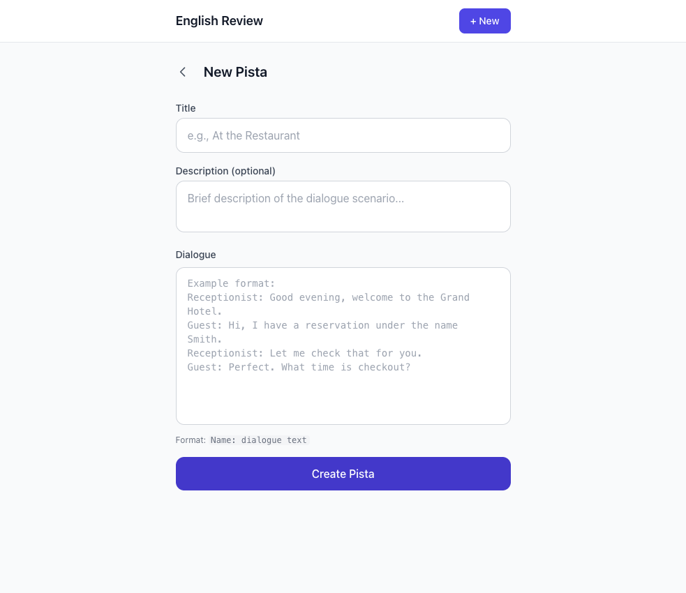
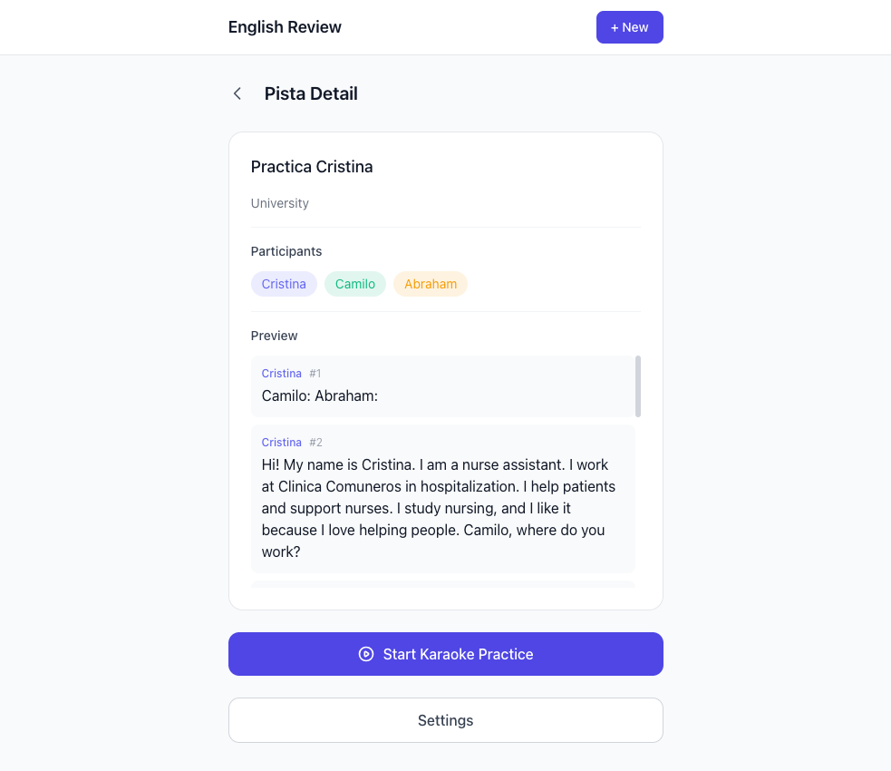
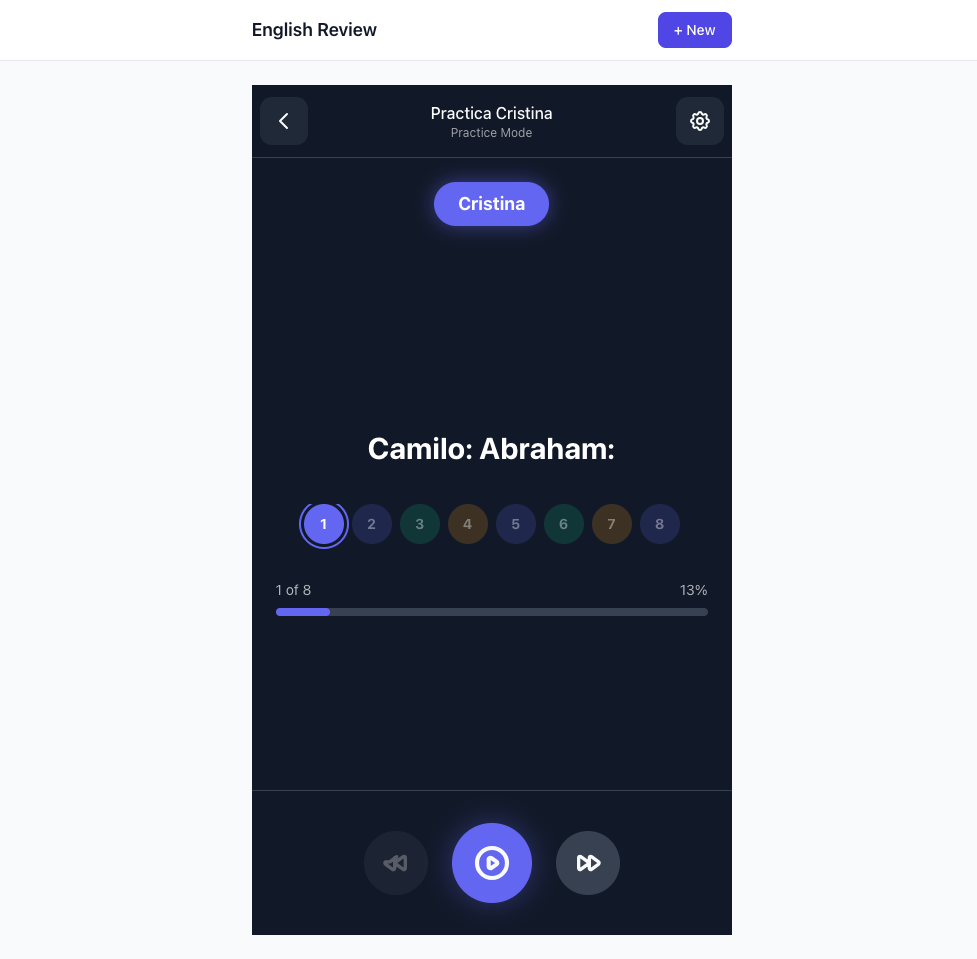
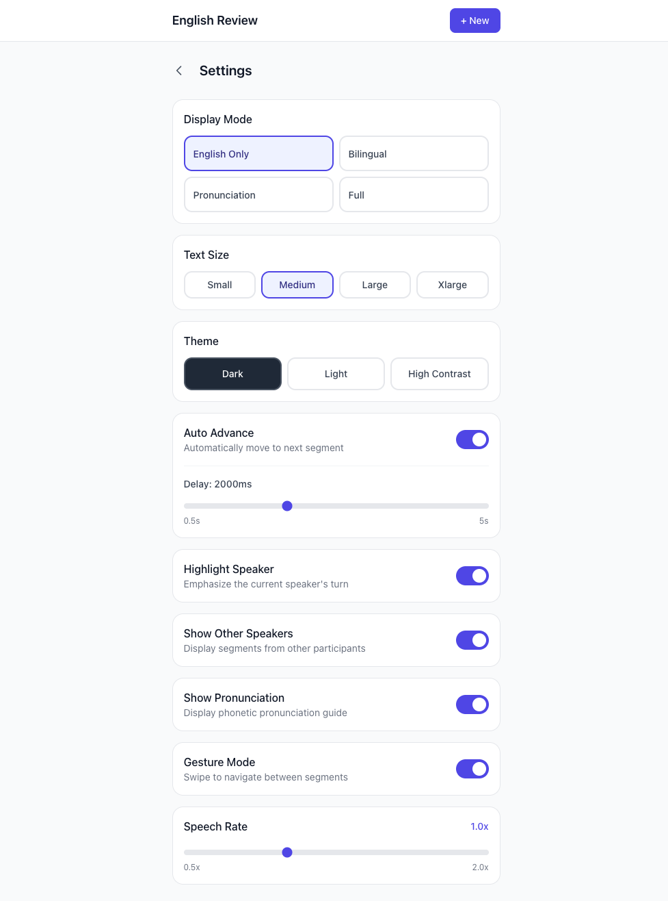

# English Review

Aplicación mobile-first de práctica oral de inglés en estilo karaoke, diseñada para el aprendizaje contextual de idiomas. La unidad central de trabajo es la **pista** — un recurso interactivo que combina diálogo, pronunciación y práctica oral.

**Deploy activo:** [https://english-review.luis-sanchez-dev.workers.dev](https://english-review.luis-sanchez-dev.workers.dev)

> **Nota:** El origen canónico desplegado es el Cloudflare Worker en `workers.dev`. Cualquier otro dominio o CDN apunta a esta fuente.

---

## Capturas de pantalla

| Inicio | Nueva pista |
|:---:|:---:|
|  |  |

| Detalle de pista | Karaoke |
|:---:|:---:|
|  |  |

| Settings |
|:---:|
|  |

---

## Funcionalidades principales

- **Gestión de pistas:** crear, ver y administrar pistas de práctica oral.
- **Modo karaoke:** práctica interactiva con visualización de diálogo en tiempo real.
- **Modos de visualización:** inglés puro, bilingüe (inglés/español), pronunciación fonética, o versión completa.
- **Configuración por pista:** ajuste de velocidad de speech, selección de voz, autoplay y highlighting de hablante activo.
- **Progreso por sesión:** cada usuario mantiene su posición en cada pista de forma independiente.
- **Base de datos D1:** persistencia en SQLite vía Cloudflare D1, con ORM Drizzle.
- **Estilo mobile-first:** interfaz optimizada para dispositivos móviles con Tailwind CSS.

---

## Flujo de uso (usuario final)

1. **Inicio:** el usuario accede a la pantalla de inicio y ve el listado de sus pistas.
2. **Crear pista:** hace clic en "Nueva pista", completa título, descripción y estructura el diálogo con participantes y segmentos.
3. **Detalle de pista:** al seleccionar una pista, ve el resumen, participantes y segmentos disponibles.
4. **Práctica karaoke:** ingresa al modo karaoke donde el diálogo avanza automáticamente. Cada segmento muestra el texto según el modo de visualización configurado.
5. **Configuración:** desde el engranaje puede ajustar velocidad de voz, modo de visualización, delay de avance automático y preferencias deUI.
6. **Continuar:** el sistema recuerda en qué segmento quedó, permitiendo retomar la práctica en cualquier momento.

---

## Stack técnico

| Capa | Tecnología |
|------|------------|
| Frontend | React 18 + Vite |
| Routing | React Router v7 (SSR) |
| Runtime | Cloudflare Workers |
| Persistencia | Cloudflare D1 (SQLite) |
| ORM | Drizzle ORM |
| Estilos | Tailwind CSS v3 |
| Despliegue | Wrangler CLI + Cloudflare Workers |

---

## Instalación local

```bash
# Clonar y entrar al proyecto
git clone <repo-url> && cd english-review

# Instalar dependencias
npm install

# Iniciar servidor de desarrollo (http://localhost:8788)
npm run dev
```

---

## Variables y servicios necesarios

| Variable/Servicio | Descripción |
|-------------------|-------------|
| `APP_ENV` | Entorno (`development` / `production`) |
| `DB` | Binding D1 (base de datos SQLite en Cloudflare) |
| `ASSETS` | Binding a assets estáticos (dist/client) |
| `CLOUDFLARE_ACCOUNT_ID` | ID de cuenta Cloudflare |
| `CLOUDFLARE_API_TOKEN` | Token de API (para despliegue, no para desarrollo local) |

> No se exponen secretos en este archivo. Usar `wrangler secret put` para valores sensibles en producción.

---

## Base de datos D1 y migraciones

La base de datos `english-review-db` está configurada en `wrangler.toml`. Las migraciones se gestionan con Drizzle Kit.

```bash
# Generar migraciones desde cambios en el schema
npm run db:generate

# Aplicar migraciones (desarrollo local)
npm run db:migrate

# Abrir Drizzle Studio (editor visual de la DB)
npm run db:studio

# Push directo del schema al D1 local (úsalo tras modificar schema.ts)
npm run db:push
```

Para aplicar migraciones en el D1 **remoto** (producción):

```bash
wrangler d1 migrations apply english-review-db --remote
```

---

## Comandos útiles

| Comando | Descripción |
|---------|-------------|
| `npm run dev` | Inicia el servidor de desarrollo en `http://localhost:8788` |
| `npm run build` | Compila el proyecto para producción |
| `npm run preview` | Previsualiza el build localmente |
| `npm run db:generate` | Genera migraciones Drizzle desde el schema |
| `npm run db:migrate` | Aplica migraciones al D1 local |
| `npm run db:studio` | Abre Drizzle Studio para edición visual |
| `npm run db:push` | Push directo del schema al D1 local |
| `npm run typecheck` | Verificación de tipos TypeScript sin emit |

---

## Estructura del proyecto

```
english-review/
├── src/
│   ├── router.tsx          # Definiciones de rutas y componentes de página
│   ├── main.tsx           # Punto de entrada
│   ├── worker.ts          # Handler del Worker (SSR/API)
│   ├── app.css            # Estilos globales (Tailwind)
│   ├── lib/
│   │   ├── db/
│   │   │   ├── schema.ts  # Schema Drizzle (pistas, participantes, segmentos, etc.)
│   │   │   └── client.ts   # Operaciones de base de datos
│   │   └── dialogue-parser.ts  # Procesamiento de diálogo y cálculo de visibilidad
│   ├── types/
│   │   └── domain.ts      # Tipos de dominio (DisplayMode, UserSettings, Script, Segment, etc.)
│   └── components/         # Componentes UI reutilizables
│
├── functions/
│   └── [[path]].ts        # Handler SSR de Cloudflare Pages
│
├── drizzle/
│   └── migrations/
│       └── 0000_initial.sql  # Migración inicial del schema
│
├── docs/
│   └── screenshots/       # Capturas de pantalla para documentación
│
├── wrangler.toml          # Configuración de Workers y D1
├── vite.config.ts         # Configuración de Vite + plugin Cloudflare
├── tailwind.config.js     # Configuración de Tailwind CSS
└── package.json           # Dependencias y scripts
```

---

## Despliegue en Cloudflare

El proyecto usa **Cloudflare Workers** como destino de despliegue. La configuración en `wrangler.toml` define:

- El entry point `src/worker.ts`
- El directorio de assets estáticos `dist/client`
- El binding D1 `english-review-db`

```bash
# Build de producción
npm run build

# Despliegue al Worker remoto
wrangler deploy
```

> El origen canónico y recomendado para acceso público es el Worker en `workers.dev`. Otras configuraciones de CDN o dominios personalizados derivan de este origen.

---

## Rutas de la aplicación

| Ruta | Descripción |
|------|-------------|
| `/` | Inicio — listado de pistas |
| `/new` | Crear nueva pista |
| `/script/:scriptId` | Detalle de una pista |
| `/script/:scriptId/karaoke` | Modo práctica karaoke |
| `/settings` | Preferencias del usuario |
